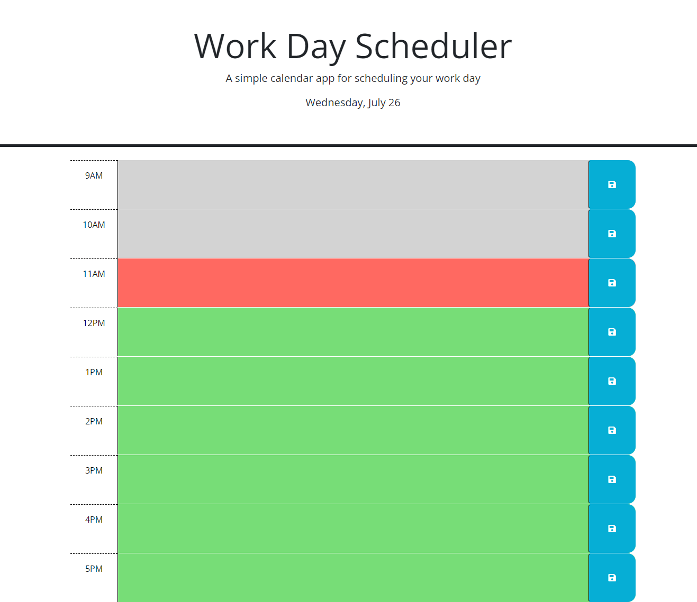

# <Challenge 5: Work Day Scheduler>

## Description

- In this project, a fictional company tasked us with making a scheduler application for organizing their workday.
- We were given a substantial amount of starter code, including referential timeblock elements in the html sheet. Most of our work would be in the blank javascript sheet.
- With our understanding of third-party APIs like Day.js and some intelligent use of jQuery, we were able to fill in the needed script and get it to work well within the acceptance criteria.

## Usage

- To use the scheduler, first navigate to the webpage. At time of publication, the project can be found deployed at https://dopalescent.github.io/Work-Day-Scheduler/
- The page will feature a header with the weekday and current date listed at the bottom. Below that will be nine timeblocks representing the hours of the workday. If the current time is within the workday, the corresponding timeblock will be red. Timeblocks before this will be grey, and timeblocks after will be green.
- Text can be entered into the colored field on each timeblock. Clicking the blue button to the right of the text field will save that timeblock's contents to local storage. On reloading the page, previous entries will appear in their corresponding timeblocks, having been retrieved from local storage.

- The following screenshot previews the deployed project:

## Credits

- Penn LPS Boot Camp program for education and resources
- MDN Web Docs for their useful references
- Day.js for their date and time library
- EdX and The Full-Stack Blog for their 'Professional README Guide' article